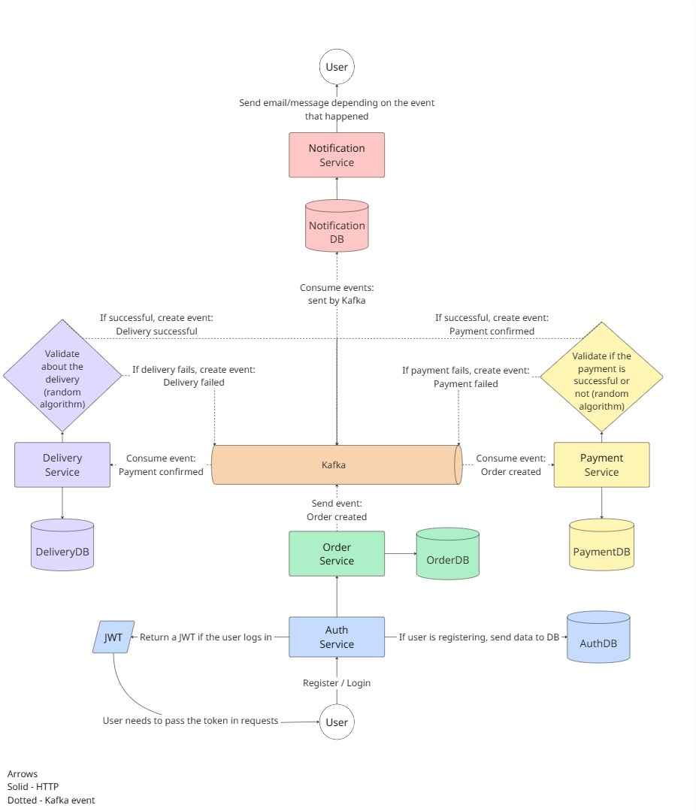

# MicroLivery
A delivery system based on a **microservices architecture**, developed with **Java and Spring Boot**.

It follows an **event-driven architecture**, using **Apache Kafka** for asynchronous communication between services and **REST** for synchronous operations.  
The project applies good development practices and modern technologies such as **PostgreSQL**, **Docker**, and more.

The system is composed of **five independent microservices**, each responsible for a specific domain. Together, they form the complete delivery workflow: from **user registration** to **final delivery**.

## Architecture Overview
This flowchart below illustrates the **MicroLivery** architecture, showing the event-driven communication between microservices using **Kafka** for asynchronous messages and **REST** for synchronous ones.

